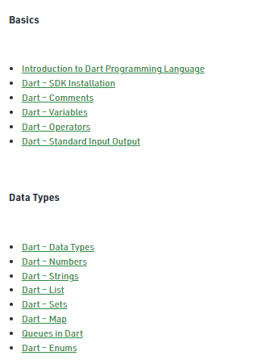
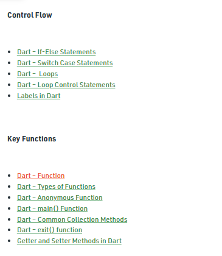

# Week 3: Basics Review

## Content:

- Please, make sure that you know Dart tutorials [ Basics, Data Types, Control Flow, and Key Function ] on GeeksForGeeks:
    
    [https://www.geeksforgeeks.org/dart-tutorial/](https://www.geeksforgeeks.org/dart-tutorial/)
    

## Tasks:

Please, solve the following problems in Dart:

- [https://docs.google.com/document/d/1YwhSwoECcwXobCMF1z_VFcxpkxb69IllkSgC2unEWLg/edit?usp=sharing](https://docs.google.com/document/d/1YwhSwoECcwXobCMF1z_VFcxpkxb69IllkSgC2unEWLg/edit?usp=sharing)

Please, sketch the widget trees of the following screens:

- [Screen 4 ](https://www.notion.so/Screen-4-d1a3fd5ae7394ed094e9fd70a292167e)

- [Screen 5](https://www.notion.so/Screen-5-5eb4ad13415344ba9734e45497ccf9f1)