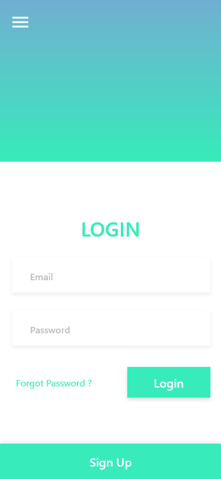
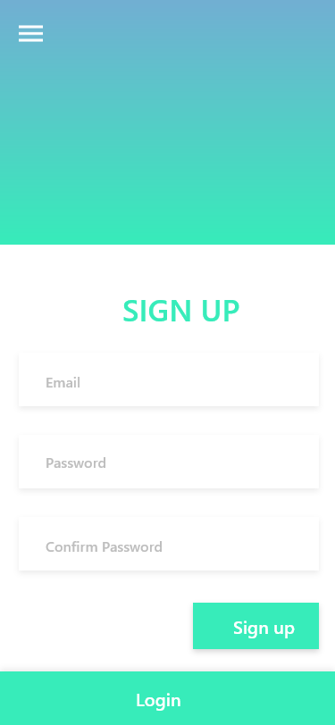

# Practical Break: W01

**Task 01 (Flutter):**

Create these screens, Login & Register, and make sure they should navigate to each other. When the user open the app, the user should see the Login screen first. Then, when he press on sign up or register button, the app should Navigate to the Register screen. After that the user is able to return back to the login screen.
 

---

---

**Task 02 (Dart: OOP):**

In the beginner project, each one of us chose one of the following systems, started working on defining the entities (classes), properties and functions of each entity (variables), and then the coding part. In this task, we will do the same thing but **each one must choose a system different from the one that he/she worked on in the beginner project**.

The systems are:

- Bank Management System
- Student Record Management System
- Car Rental System
- Sales Management System
- Hotel Booking System
- Contact Management System

---