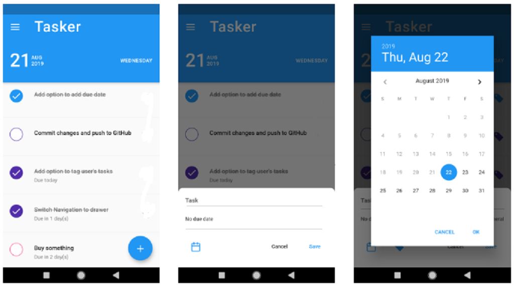

# Week 10: SQLite (1)

## Content:

- Data Persistence:
    
    [https://youtube.com/playlist?list=PL3aG1K3LWCre5saKBGuCFU6Ay67GPY7qm](https://youtube.com/playlist?list=PL3aG1K3LWCre5saKBGuCFU6Ay67GPY7qm)
    

## Tasks:

**This task will need some effort so try to start doing the task early to have the enough time. The task is a ToDo application.** The main screen is a listview containing different Todos, that are stored in SQLite Database on the mobile, and a Floating Action Button that opens a bottom sheet to add a new Todo to the SQLite Database. Feel free to enhance the UI as much as you like to but after making sure it works properly.

**An important note:** Since we didn’t study state management yet, after adding new Todo we will find that the list isn’t updated directly. So to check if the item is added to SQLite or not, you can hot restart the application to rebuild the app and re-retrieve the list from SQLite with the start of the app.

**Another important** n**ote:** Search for the widget Future Builder, it will make retrieving the Todo stored in SQLite much easier but it’s quite advanced so you will need to do some extra search and practice. 

Some resources for Future Builder:

[https://www.youtube.com/watch?v=ek8ZPdWj4Qo](https://www.youtube.com/watch?v=ek8ZPdWj4Qo)

[https://www.geeksforgeeks.org/flutter-futurebuilder-widget/](https://www.geeksforgeeks.org/flutter-futurebuilder-widget/)