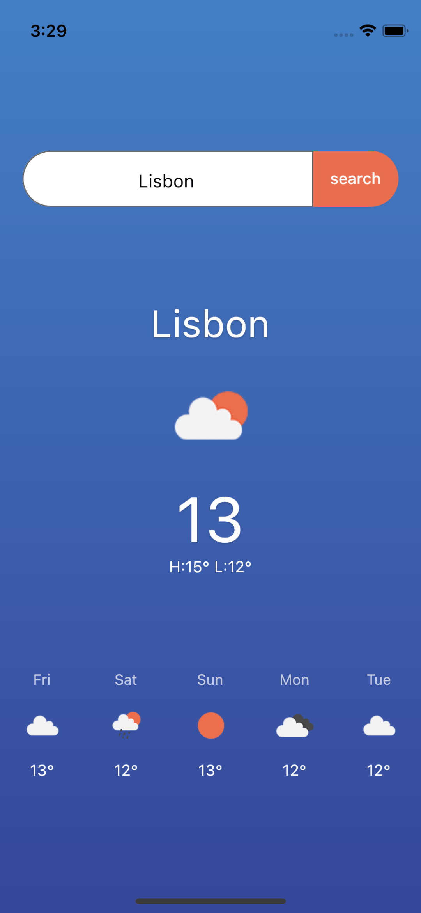

# Week 12: Async Dart & API

## Content:

- Networking (working with API): videos from 73 to 78 (http)
    
    [https://youtube.com/playlist?list=PL3aG1K3LWCre6DIC2amKlXjn_kd2P6zE9](https://youtube.com/playlist?list=PL3aG1K3LWCre6DIC2amKlXjn_kd2P6zE9)
    
- Async Dart: this playlist is very good for revising some main concepts like Async, Futures, Null Safety, etc.
    
[https://youtube.com/playlist?list=PLjxrf2q8roU0Net_g1NT5_vOO3s_FR02J](https://youtube.com/playlist?list=PLjxrf2q8roU0Net_g1NT5_vOO3s_FR02J)
    
## Tasks:
    
The task for this week will be creating a Weather App. The app should preview the weather of the current location by default and allows the user to search for the weather at a specific place. Through this task, you will need to do some search. The API used is:
    
[https://openweathermap.org/](https://openweathermap.org/)
    
### The app design:
#
    
